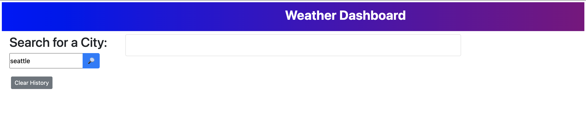
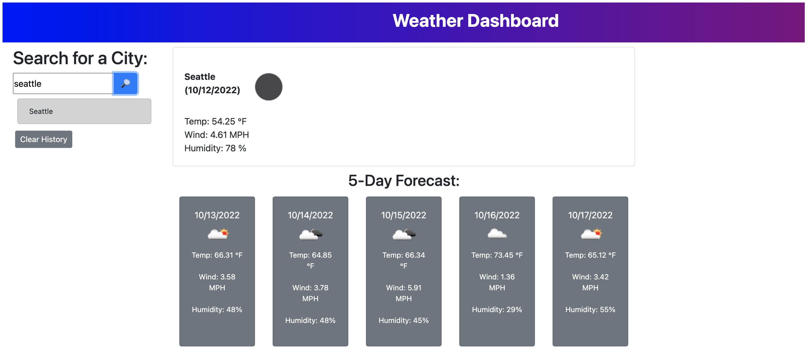
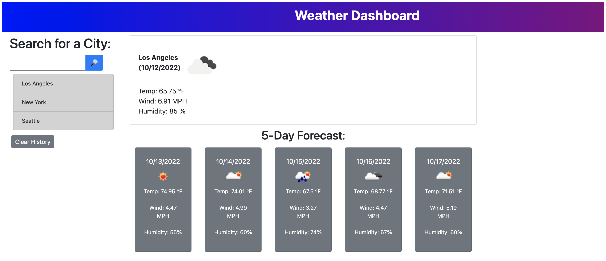

# Module 6 Challenge

## Weather Dashboard

# Description

The aim of this project was to build a weather dashboard utilizing the third party API 'OpenWeather'. When the user searches for a city, they are presented with the current conditions, and the conditions for the next five days. The conditions displayed are temperature, wind speed, humidity, and an icon representing the weather conditions. Once a city is searched, it appears in a search history, where its information can be accessed again by clicking on it.

# Usage

Deployed webpage: https://noah138.github.io/weather-report/

To use, first type in a city into the search bar:

Pressing enter will display the weather conditions of that day and the next five days:

After entering a city, it is saved under the search bar, and can be accessed again by clicking ot it.

Pressing the 'Clear History' button will clear the saved cities.

# Credits

The excellent team of instructors at the UW full-time online coding camp 2022.
